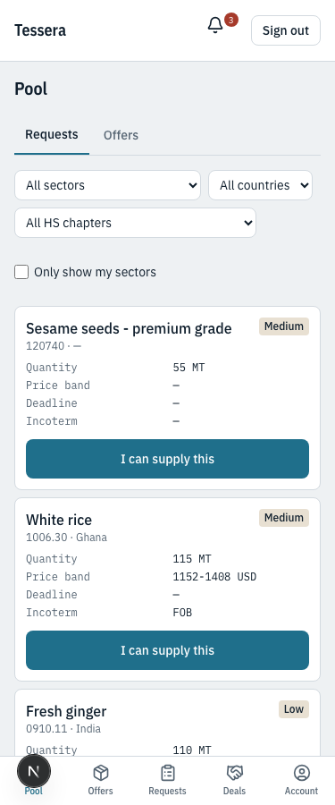
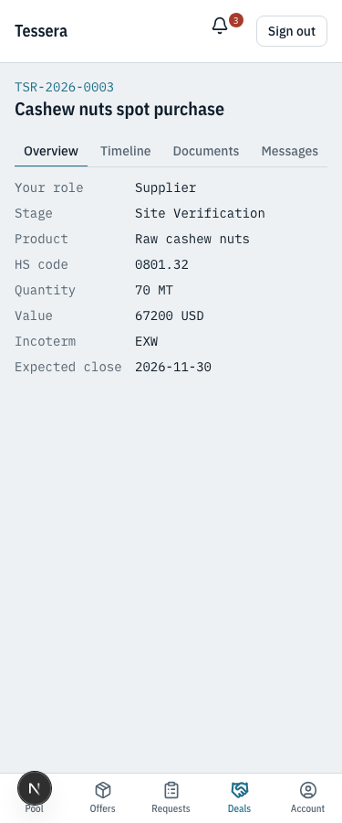
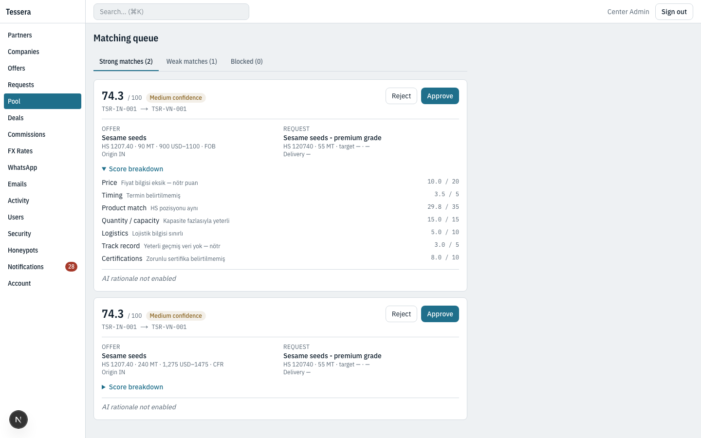
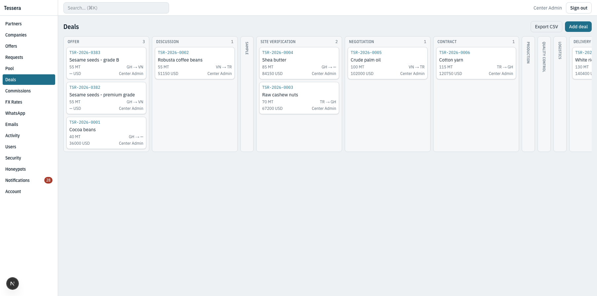
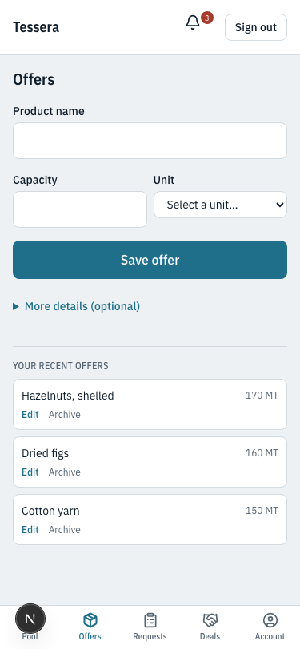
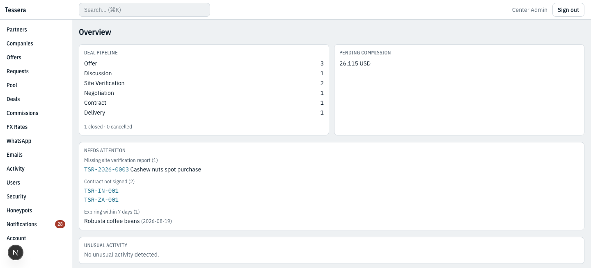
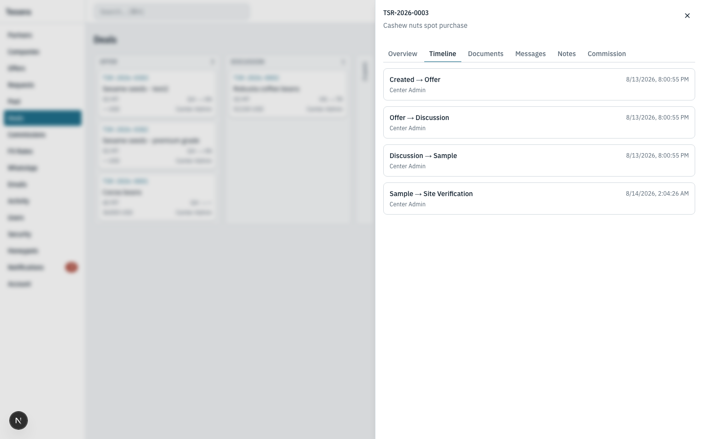
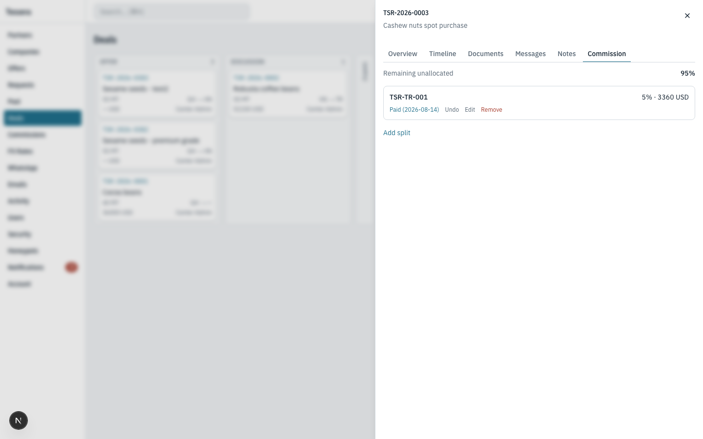

# B2B Trade Brokerage Platform — Architecture Case Study

> A multi-tenant operations platform for a cross-border trade brokerage, built solo using Next.js 15, TypeScript, Supabase and Playwright.
>
> This document describes the architecture and the engineering decisions behind it. The source code is private; this is a technical overview intended for portfolio purposes.

**→ [Selected code samples](code-samples.md)** — six annotated excerpts covering RLS design, database-enforced business rules, matching logic, money handling, and access-coverage testing.

*A note on language: the application's user-facing strings are in Turkish, since that's the operating team's working language. Code, comments and this document are in English. Some screenshots therefore show Turkish labels.*

---

## The problem

A trade brokerage coordinates a network of country representatives who source buyers and suppliers in their own markets. The centre matches the two sides, takes a commission, and guarantees the process.

Everything ran on WhatsApp. There was no record of who said what, no visibility into which deal was at which stage, no commission ledger, and no evidence trail if a dispute arose.

The obvious solution — an off-the-shelf CRM — fails on one requirement, and it happens to be the requirement the entire business model rests on.

---

## The constraint that shaped everything

**Partners must never see each other.**

If a supplier-side partner in one country can identify the buyer-side partner in another, they can transact directly and cut out the brokerage. The company's entire value — and its revenue — depends on being the only party that sees both sides.

No off-the-shelf CRM can do this. In Salesforce, HubSpot or Pipedrive, users in the same org share a data model by default; sharing rules restrict records but the model still assumes a single organisation looking at its own pipeline. Here there are effectively 25+ mutually hostile tenants who must collaborate through a broker without ever meeting.

This is what made a custom build necessary rather than merely preferable.

---

## Isolation model

Three layers, each independently sufficient:

**1. Row Level Security on every table.** No exceptions. A test walks the schema and fails if any table has RLS disabled or has zero policies — silence is never a passing grade.

```
Partner sees:     own companies, own listings, own deals, own commission line
Partner never sees: other partners, the matching queue, the activity log,
                    anyone else's commission, counterparty identity
```

**2. Anonymised pool views.** Partners browse open opportunities through dedicated views that structurally cannot expose identity — the underlying columns aren't in the projection. Price is shown as a band, never an exact figure. A partner doesn't see their own listings either, because seeing your own record anonymised tells you how much anonymisation leaks.

**3. Application-level checks that don't trust the middleware.** Every route layout and every server action re-verifies the caller's role. A misconfigured route matcher shouldn't be able to collapse the whole model.



*The pool as a partner sees it: product, HS code, quantity, destination and a price band. No company, no counterparty, no exact figure. The [view definition](code-samples.md#3-anonymised-opportunity-pool) is where this is enforced — the identifying columns are simply not in the projection.*

### The subtlety that mattered most

In a deal, the counterparty is never displayed — not even as "Center."

The reason: if the field said "Center" when the centre was the counterparty and stayed blank otherwise, the *absence* of the label would reveal that the counterparty was another partner. **The absence of information is itself information.** Partners see only "Your role: Supplier."



*A deal from the partner's side. Commercial terms are visible; the other side of the transaction is not — in any form.*

---

## Matching engine

The system suggests supplier-buyer pairs. Two design decisions define it.

### Scoring is deterministic, not generative

An LLM writes the *rationale*; it never produces the *score*. The score comes from weighted code:

| Component | Weight | Logic |
|---|---|---|
| Product | 35 | HS code primary, embeddings as tiebreaker |
| Price | 20 | Gap under 5% closes in negotiation; over 15% scores zero |
| Quantity | 15 | Below MOQ is a hard blocker |
| Logistics | 10 | Corridor, Incoterm, landlocked penalty |
| Certification | 10 | Missing mandatory certs block |
| Timing | 5 | Under 14 days is unrealistic for production + shipping |
| Track record | 5 | Returns null under 3 closed deals — no fabricated scores |

Rationale: the same pair must produce the same number every time, and the number must be explainable to the person approving the deal. An LLM-generated score drifts between runs and can't be audited.



*Every suggestion opens to show which component contributed what, and why. Blocked matches — a quantity below the supplier's minimum, a missing mandatory certificate — are kept and shown separately rather than discarded: they're often resolvable in conversation, and hiding them would remove a decision the operator should be making.*

See [`scoreProduct`](code-samples.md#4-tiered-confidence-in-product-matching) for the tiered-confidence logic below.

### HS codes carry the semantic weight

Product names vary by language and market — "semi-milled rice," "beyaz pirinç," "white rice 5% broken." Text matching finds none of these equivalent.

The Harmonised System code is the shared key. But it has two gaps: partners can leave it blank (the mobile form has three required fields and HS isn't one of them, because a 30-second form is more valuable than a complete one), and chapter-level matches are ambiguous — chapter 15 covers both olive oil and palm oil.

pgvector embeddings fill exactly those gaps:

| Situation | Behaviour |
|---|---|
| HS matches at 6 digits | Full marks, embeddings unused |
| HS chapter matches only | Embeddings disambiguate |
| No HS code | Embeddings alone |

The LLM is explicitly forbidden from guessing HS codes. A wrong code corrupts matching silently and permanently. Instead the extracted product name is looked up in the official WCO list; if there's no single clear match, the field stays empty and the confirmation message shows it as blank.

---

## Enforcing process in the database

The commercial process has a step that cannot be skipped: a partner must physically visit the supplier's facility and file a verification report.

This isn't a UI convention. A [database trigger](code-samples.md#2-a-business-rule-enforced-in-the-database) blocks the stage transition until a document of type `site_report` exists on the deal. The UI surfaces this proactively — the control is disabled with the reason stated, so the user never encounters a raw Postgres error.



*The pipeline. Site verification sits between sampling and negotiation, and nothing crosses it without evidence on file.*

The same pattern is applied to every rule where drift would be expensive:

- Country code is immutable after the partner code is generated
- Introducing partner is immutable — commission entitlement depends on it
- No stage may be skipped; backward moves require a mandatory reason note
- Closed and cancelled deals are terminal
- A partner without a signed agreement cannot be party to a deal
- Audit logs are append-only, enforced by trigger even if a policy is later loosened

The principle: rules the business depends on live where they cannot be bypassed by a future code path, a direct SQL session, or a forgotten check.

---

## Security

Six real vulnerabilities were found and closed during audits. What matters isn't that they existed — it's that the mechanism for finding them was built.

| Finding | Root cause |
|---|---|
| Pool views readable by anonymous role | RLS doesn't apply to views |
| Matching functions callable by any authenticated user | Postgres grants EXECUTE to PUBLIC by default |
| Same mistake repeated in four later functions | Platform-level `ALTER DEFAULT PRIVILEGES` isn't undone by `REVOKE FROM PUBLIC` |
| Suspended partner's session stayed live | Revoking DB access doesn't invalidate an issued token |
| Either party could delete the other's messages | Policy checked deal membership but not authorship |
| Audit log was mutable by admins | Evidence with no integrity guarantee is not evidence |

The durable fix wasn't the patches — it was [a test](code-samples.md#6-access-coverage-as-a-test) that maintains an explicit access map for every function and view in the schema and fails when something new appears without a declared policy. That test caught the fourth finding while it was being written.

### Threat model beyond the perimeter

External attack surface is the easy half. In a brokerage, the more probable threat is a legitimate partner behaving badly: scraping the pool systematically, filing a site report with another factory's photograph, or exporting their entire book before leaving.

Mitigations built for this:

- Per-partner daily activity thresholds with alerts to the centre — notification, never blocking, because false positives that lock out a working partner cost more than they save
- Geographic anomaly detection for shared credentials
- EXIF (location, timestamp) retained on verification photographs as evidence
- Honeypot records: fabricated listings that appear genuine in the pool. If one surfaces externally, a leak is confirmed and its source is identifiable
- Per-partner watermarking on pool views

---

## Structured data entry over WhatsApp

The largest risk to a system like this isn't technical failure — it's an empty database. Partners in the field will not open an app to fill in a form. They will send a WhatsApp message, because that's what they already do.

Rather than fighting the habit, the channel was brought inside:

```
Voice note or text
    ↓  Whisper transcription (original language preserved)
    ↓  Structured extraction, multilingual
    ↓  Deterministic HS lookup — never LLM-guessed
    ↓  Interactive confirmation buttons
    ↓  Record created, embedded, matched
```

Design decisions worth noting:

- **Buttons, not free text, for confirmation** — parsing "yes" across a dozen languages is unreliable. Free-text confirmation exists as a fallback with exact-match only: "yes I have 500 MT rice" is a listing, not a confirmation.
- **Confirmation messages stay in English** — the template is fixed, never LLM-generated, precisely so the numbers a partner approves cannot be mistranslated. The same reasoning that keeps HS codes out of the LLM's hands.
- **Missing fields are shown as blank, not inferred.** If the extraction is incomplete, the system asks rather than guesses.

Voice matters more than it looks: several partners write English with difficulty but speak their own language fluently. Transcription plus multilingual extraction means they speak naturally and the system stores structured English.



*The in-app alternative: three required fields, everything else behind a collapsed section, recent products offered as one-tap chips. The target was thirty seconds on a phone, one-handed — because a form that takes five minutes is a form that doesn't get filled in.*

---

## Testing

461 unit and integration tests, 50 end-to-end, running against a local Supabase stack and — via a dedicated command — against the hosted project before any release.

The tests that earn their keep aren't the ones covering happy paths:

- **Access isolation.** Partner A attempting every operation against Partner B's records — select, insert, update, delete.
- **Raw network response inspection.** Not visible on screen isn't good enough; the assertion is that forbidden field names don't appear as strings in the response body.
- **Schema coverage.** Every table has RLS; every function and view has a declared access policy. New objects fail the suite until declared.
- **Money.** Commission splits, rounding, currency conversion, partial refunds. All arithmetic goes through [integer-cent helpers](code-samples.md#5-money-arithmetic) — floating point never touches a monetary value.
- **Process rules.** Every database-enforced constraint has a test that deliberately violates it.

Each protective test was verified by deliberately breaking the thing it protects and confirming it turned red. A test that cannot fail is worse than no test — it manufactures confidence.

---

## The centre's daily view



*The first screen of the day. Pipeline by stage, pending commission by currency — never collapsed into a single figure with an invented exchange rate — and a "needs attention" block: deals missing site verification, partners without a signed agreement, listings about to expire.*



*Every stage transition, who made it and when. Backward moves require a written reason and are highlighted. This log is append-only at the database level — in a dispute it's the only evidence there is, and evidence an administrator can edit isn't evidence.*



*Commission is agreed and recorded before a deal advances past negotiation, not settled afterwards. Splits are validated to never exceed 100%, and marking a payment made is reversible.*

---

## Things deliberately not built

Restraint was as important as scope. Deferred on purpose:

| Feature | Reason |
|---|---|
| Trust scores for companies | The only honest source is transaction history. Scraping the web to generate a number produces a figure that looks authoritative and isn't. Revisit after a few hundred real deals. |
| Public self-service registration | The network's value is that it's curated. Opening it dilutes exactly what makes it work. |
| Native mobile apps | PWA covers the requirement — home screen icon, fullscreen, camera access. App store distribution adds an install step, review latency and two maintenance targets for no user-visible gain. |
| SaaS billing | The product hasn't proved itself in its own operation yet. |
| AI-written match rationale | Wired but unconnected. The deterministic score breakdown is already explainable; the LLM layer is a convenience, not a dependency. |

---

## Stack

**Next.js 15** (App Router, server actions) · **TypeScript** strict · **Supabase** (Postgres, Auth, Storage, RLS) · **pgvector** · **Tailwind v4** · **Radix / shadcn-ui** · **Vitest** · **Playwright** · **OpenAI** (embeddings, transcription) · **WhatsApp Cloud API** · **Resend**

---

## What I'd underline

**The hardest problems were not technical.** The isolation model, the immutable fields, the mandatory verification gate — these are business rules that took longer to get right than to implement. Understanding *why* a partner must never see a counterparty was more work than writing the policy that enforces it.

**Silent failures are the expensive ones.** An empty commission percentage saved as 0%. Embeddings quietly null because a process restart never picked up an environment variable. A backup script that had never been restored from. Each was found by looking rather than by anything failing loudly — and each is now surfaced or asserted.

**Verification means looking.** Confirming a CSS class exists in the HTML is not confirming the layout renders. Reading a query plan is not reading the screen. Several defects survived multiple rounds of "verified" until someone actually looked at the output.

---

**→ [Selected code samples](code-samples.md)**
